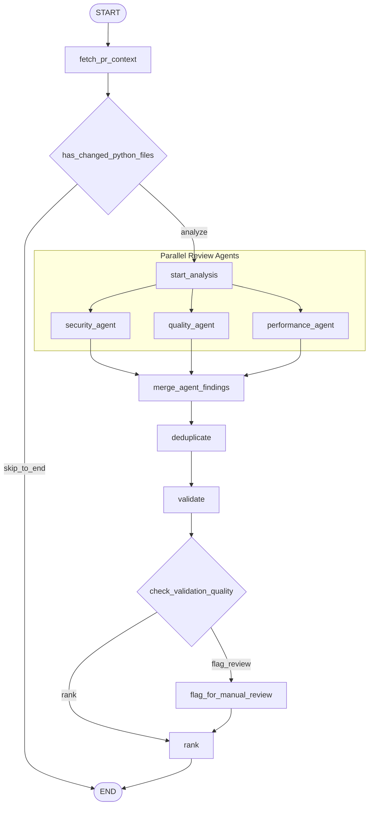

# MONACO: AI-Powered Code Review Engine

MONACO is a state-of-the-art, graph-orchestrated, AI-powered code review platform designed to analyze pull requests, verify security and performance constraints, and post targeted, idempotent inline review comments directly to GitHub. 

Unlike conventional platforms that treat LLMs as trusted decision-makers, MONACO treats AI as a **generator of evidence** that must be deterministically validated against static analysis and repository-wide context before being surfaced to developers.

---

## The Core Differentiator: AI as Evidence, Not Authority

The foundational design principle of MONACO is **deterministic validation**. LLMs excel at reasoning but suffer from hallucinations, non-deterministic formatting, and phrasing drift. To solve this, MONACO implements a dual-layer validation system:

1. **Structured Categorization over Prose Parsing:** 
   Early iterations of MONACO relied on keyword-based text parsing to match LLM findings with static analyzer alerts. This proved highly fragile; for example, an LLM reporting a hardcoded credential using a Unicode non-breaking hyphen (`Hard\u2011coded` instead of `hard-coded`) bypassed deduplication and resulted in double-posting. MONACO resolved this by constraining the LLM to a strict JSON schema containing a fixed `rule_category` (e.g., `hardcoded_secret`), which is mapped programmatically to concrete rule identifiers (e.g., `AI_HARDCODED_SECRET`).
2. **AST-Grounded Semantic Validation:**
   Every AI finding is validated against the file's Abstract Syntax Tree (AST) before approval. For example, if the AI reports a security issue claiming dynamic execution exists but the parsed AST contains no calls to `eval()` or `exec()` anywhere in the file, the finding is immediately rejected.
3. **Subject-Identity Deduplication:**
   To prevent proximity-based over-merging (e.g., two distinct hardcoded secrets like `API_KEY` on line 7 and `SECRET_TOKEN` on line 8 being merged purely due to line proximity), the deduplicator extracts the semantic subject (e.g. the variable name) from both the static and AI finding. If the variable names differ, they are preserved as separate findings, ensuring no critical vulnerabilities are silently lost.

---

## LangGraph Orchestration Architecture

MONACO coordinates its analysis using a non-linear state graph built on **LangGraph**. This allows concurrent execution of analysis layers, dynamic conditional routing, and automated fallback logic.



### Key Graph Architectural Decisions:
* **Conditional Bypass:** If a PR does not modify any Python files (e.g. only modifying `README.md`), the heavy analysis nodes are skipped, saving compute and API token costs.
* **Parallel Execution Fan-Out:** The security, quality, and performance agents execute concurrently. The execution wall-clock time is bound by the slowest single agent rather than the sum of all three.
* **Quality Gate Routing:** If the validation node rejects more than 50% of the findings (indicating high LLM noise or syntax mismatches), the graph branches to `flag_for_manual_review` rather than posting unreliable comments.

---

## Core Features & Codebase Layout

```
app/
├── agents/                      # Specialized agent classes (Security, Quality, Performance)
├── ai/                          # LLM connection clients and prompt templates
├── analyzer/                    # Core static AST analysis rules and data-flow analyzer
├── engine/                      # Orchestration, validation, deduplication, and ranking engines
├── github/                      # GitHub API integrations and review formatters
├── graph/                       # LangGraph state representation, nodes, and routing conditions
├── models/                      # Pydantic schemas for data modeling (Findings, Reviews)
├── repository/                  # Local git interaction and dependency graph analyzers
└── scanner/                     # Directory scanning and file type filters
```

### 1. AST Heuristics & Data-Flow Analysis (`app/analyzer/`)
* **`python_analyzer.py`**: Performs local AST checking.
* **`data_flow_analyzer.py`**: Executes data-flow tracking (taint analysis) to detect user input (`input()`) reaching dangerous sinks.
* **Implemented Rules:**
  * `SEC001`: Dangerous functions (`eval`, `exec`, `compile`).
  * `SEC002`: Hardcoded secrets (searches variables matching keywords `password`, `secret`, `token`, etc.).
  * `SEC003`: Dangerous execution APIs (`subprocess.run`, `os.system`).
  * `FLOW001`: Untrusted input flowing to `eval()` (Taint analysis).
  * `FLOW002`: Untrusted input flowing to `subprocess.run(..., shell=True)` (Taint analysis).

### 2. Specialized Review Agents (`app/agents/`)
* **`SecurityAgent`**: Executes AST heuristics, data-flow analysis, and runs an LLM review scoped exclusively to security concerns via a targeted system prompt.
* **`QualityAgent`**: Runs AST checks to detect style/maintainability issues:
  * `QUAL001`: Function body length exceeds 50 lines.
  * `QUAL002`: Control flow nesting depth exceeds 4 levels.
  * `QUAL003`: Non-trivial functions (> 5 lines) missing docstrings.
  * `QUAL004`: Bare `except:` clauses catching base exceptions.
* **`PerformanceAgent`**: Runs AST checks to optimize execution complexity:
  * `PERF001`: String concatenation (`+=`) inside loops (avoiding $O(N^2)$ reallocations).
  * `PERF002`: Eager list comprehensions passed to aggregation functions (`sum`, `any`, `all`, `min`, `max`) instead of lazy generators.

### 3. Idempotent PR Posting (`app/engine/pr_reviewer.py`)
To prevent spamming pull requests during CI/CD loops, MONACO implements two-layer idempotency:
* **Per-Commit Skip:** MONACO injects a `<!-- monaco-review:{commit_id} -->` marker into the pull request review body. If a run detects this marker on the current HEAD commit, it skips analysis entirely.
* **Per-Finding Deduplication:** Each inline comment is tagged with `<!-- monaco-finding:{file}:{line}:{rule_id} -->`. MONACO fetches all historical review comments, parses these markers, and filters out identical findings so they are not re-posted across new commits.

---

## Installation & Setup

> [!NOTE]
> **Design Tradeoff (LLM Hosting):** MONACO's AI layer leverages Groq's cloud API rather than a local or free model to ensure execution speed and high review quality. This represents a deliberate architectural tradeoff against the original goal of running entirely zero-cost, locally hosted LLMs.

### Prerequisites
* Python 3.10+
* A Groq API Key (for LLM analysis)
* A GitHub Personal Access Token (PAT) with `repo` scopes (for PR comments)

### Installation
1. Clone the repository:
   ```bash
   git clone https://github.com/Anuradha05-Tech/Monaco.git
   cd Monaco
   ```
2. Set up a virtual environment and install dependencies:
   ```bash
   python3 -m venv venv
   source venv/bin/activate
   pip install -r requirements.txt
   ```
3. Configure the environment variables in a `.env` file at the root:
   ```env
   GROQ_API_KEY=your-groq-api-key
   GITHUB_TOKEN=your-github-personal-access-token
   ```


---

## Web UI & API (Phase 17)

MONACO features a comprehensive FastAPI backend and a responsive single-page web interface. This allows developers to run, visualize, and interact with the LangGraph review pipeline directly from a web browser.

### Features
1. **Interactive Configuration Form**: Easily configure the GitHub owner, repository, PR number, and local clone path.
2. **LangGraph Execution Visualizer**: Highlights the actual graph execution path and conditional branches taken during the review run.
3. **Agent & Consolidated Findings**: Inspect raw outputs from Security, Quality, and Performance agents, or view the final AST-validated, ranked report.
4. **GitHub Comment Poster**: Preview the inline comment cards (dry-run) and publish them to the live PR with a single click.
5. **Run History Log**: Browse and reload past review runs stored locally.

### How to Run

1. **Activate the Environment**:
   ```bash
   source venv/bin/activate
   ```

2. **Start the FastAPI Backend**:
   Run the backend server from the repository root:
   ```bash
   uvicorn app.api.main:app --reload --port 8000
   ```

3. **Open the Web Frontend**:
   Once the FastAPI server is running, the frontend is served directly at:
   [http://localhost:8000/](http://localhost:8000/)

> [!IMPORTANT]
> **Local Repository Clone Requirement:** 
> The `local_repo_path` parameter must point to a pre-existing local clone of the target repository on the machine running the server. This phase does not automatically clone repositories (planned as a future roadmap improvement).

---

## Verification & Tests

MONACO has a robust testing suite consisting of **114 unit and integration tests** checking context retrieval, graph conditions, agent actions, deduplication, and GitHub API formatting.

To execute the test suite:
```bash
pytest
```

---

## Known Limitations

1. **Intra-Procedural Data Flow Only:** The data-flow analyzer tracks variables within a single function scope. It does not trace taint across function/method arguments or return values (no inter-procedural flow analysis).
2. **Brittle Fallback Matching (Legacy Path):** A keyword-based matching fallback path still exists in the codebase as a safety net for any finding completely lacking a structured `rule_id`. However, because all active review agents have been migrated to structured outputs with concrete rule IDs and categories, this brittle path is rarely if ever reached in practice during standard operations.
3. **Line-Shift Fragility:** The per-finding comment deduplicator relies on exact line numbers. If lines are inserted earlier in a file, the line numbers of unchanged downstream findings will shift, which may cause MONACO to re-post them on the new commit.

---

## Roadmap

* **AST-Based Semantic Fingerprinting:** Replace raw line numbers with AST path/hash fingerprinting for comment deduplication to survive line-shifting edits.
* **Inter-Procedural Taint Tracking:** Trace variable taint across function boundaries and method invocations.
* **Multi-Language Expansion:** Port AST parser agents to target JavaScript/TypeScript and Go.